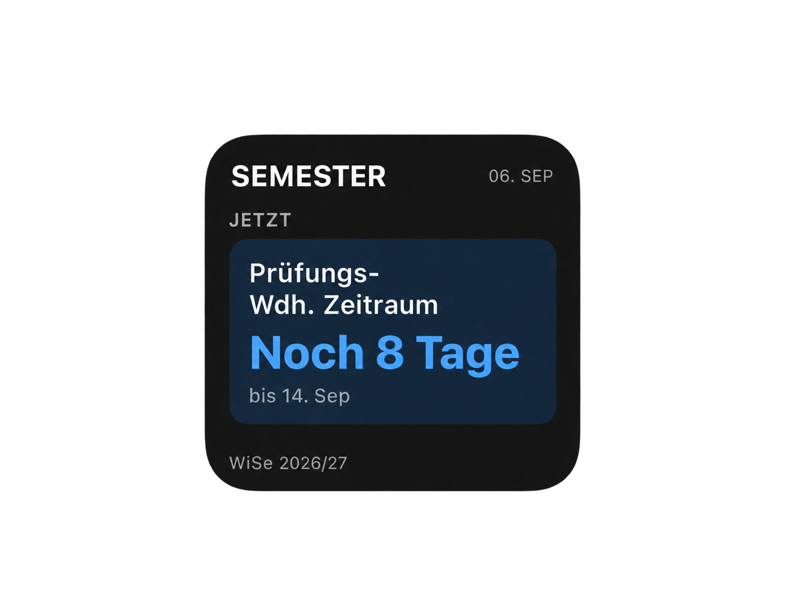
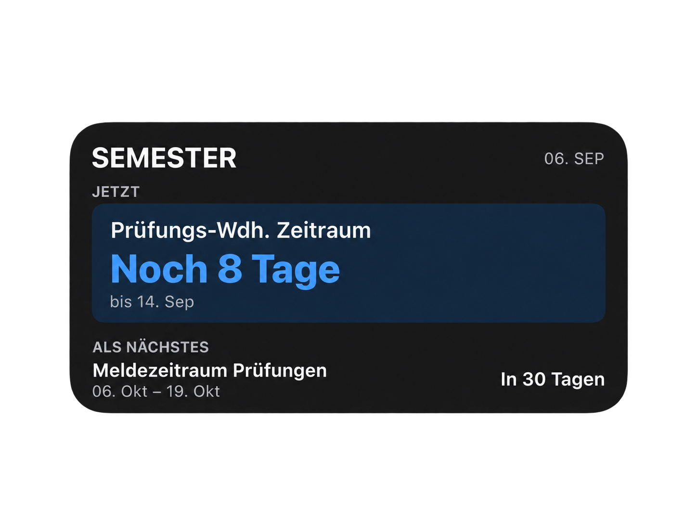
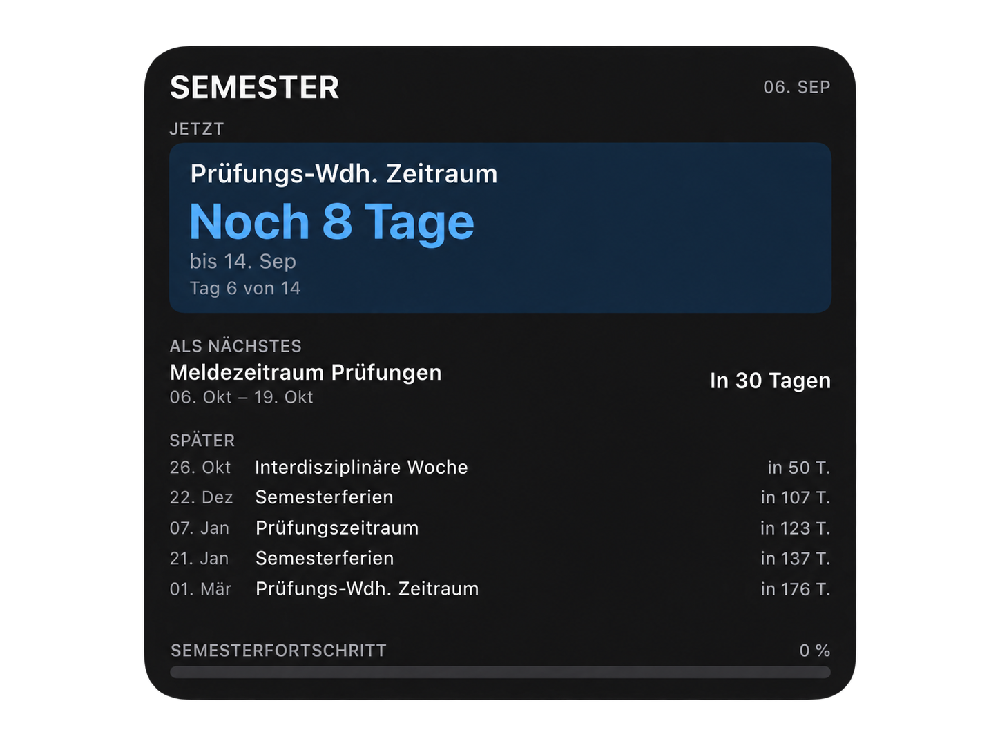

# Semester Counter – Scriptable Widget

Ein minimalistisches iPhone-Widget für wichtige Semesterzeiträume, Termine und Countdowns.

Das Widget passt sich automatisch an **Small**, **Medium** und **Large** an und verwendet standardmäßig die Semester-Daten von:

```text
https://lukasedelmann.com/semester.json
```
Sie beinhaltet alle wichtigen Termine für das Bachelor Studium Elektrotechnik an der HAW Kiel und wird regelmäßig aktualisiert.

## Vorschau

<p align="center">
  
  
  
</p>

## Features

- automatische Darstellung für **Small**, **Medium** und **Large**
- aktueller wichtiger Zeitraum als Highlight
- Countdown bis zum Ende eines laufenden Zeitraums
- Countdown bis zum nächsten wichtigen Termin oder Zeitraum
- weitere kommende Termine im Large-Widget
- Semesterfortschritt im Large-Widget
- Light- und Dark-Mode
- automatische Aktualisierung der Daten
- ein Script für alle drei Widget-Größen

## Einrichtung

Die Einrichtung dauert nur wenige Minuten.

### 1. Scriptable installieren

Installiere die kostenlose App **Scriptable** aus dem App Store und öffne sie einmal.

https://apps.apple.com/app/scriptable/id1405459188

### 2. Widget-Script kopieren

1. Öffne die `.js`-Datei dieses Widgets in diesem Repository.
2. Kopiere den kompletten Inhalt.
3. Öffne **Scriptable**.
4. Tippe oben rechts auf **+**.
5. Füge den Code ein.
6. Gib dem Script z. B. den Namen **Semester Counter**.

Du musst im Script nichts ändern.

### 3. Widget testen

Starte das Script in Scriptable über den **Play-Button**.

Danach kannst du eine Vorschau auswählen:

- Small
- Medium
- Large

Wenn die Vorschau korrekt angezeigt wird, ist das Script fertig eingerichtet.

### 4. Widget zum Homescreen hinzufügen

1. Halte den iPhone-Homescreen gedrückt.
2. Wähle **Widget hinzufügen**.
3. Suche nach **Scriptable**.
4. Wähle die gewünschte Größe.
5. Füge das Widget hinzu.
6. Halte das neue Widget gedrückt und wähle **Widget bearbeiten**.
7. Wähle bei **Script** dein Script **Semester Counter** aus.

Fertig.

Dasselbe Script kann gleichzeitig für mehrere Widget-Größen verwendet werden.

## Darstellung

### Small

Zeigt genau die aktuell wichtigste Information:

- laufender Zeitraum, oder
- nächster wichtiger Termin

### Medium

Zeigt:

- aktuellen Zeitraum oder Termin
- den nächsten kommenden Eintrag

### Large

Zeigt zusätzlich:

- mehrere weitere Termine
- Semesterfortschritt

## Aktualisierung

Das Widget lädt die Semester-Daten automatisch neu.

Wichtig: iOS entscheidet selbst, wann Homescreen-Widgets tatsächlich aktualisiert werden. Das Script fordert regelmäßige Aktualisierungen an, kann den exakten Zeitpunkt aber nicht garantieren.

---

# Optional für Kenner

## Eigene Datenquelle verwenden

Standardmäßig wird diese Datei verwendet:

```javascript
const DATA_URL =
  "https://lukasedelmann.com/semester.json";
```

Wenn du eigene Semester-Daten verwenden möchtest, kannst du die URL einfach durch eine öffentlich erreichbare JSON-Datei ersetzen:

```javascript
const DATA_URL =
  "https://example.com/semester.json";
```

## Aufbau der `semester.json`

Beispiel:

```json
{
  "semester": "WiSe 2026/27",
  "timezone": "Europe/Berlin",
  "semesterStart": "2026-09-14",
  "semesterEnd": "2027-02-28",
  "items": [
    {
      "type": "period",
      "title": "Prüfungsanmeldung",
      "start": "2026-09-01",
      "end": "2026-09-09",
      "category": "important",
      "priority": 10
    },
    {
      "type": "period",
      "title": "Interdisziplinäre Woche",
      "start": "2026-09-28",
      "end": "2026-10-02",
      "category": "semester",
      "priority": 8
    },
    {
      "type": "event",
      "title": "Mathe-Klausur",
      "start": "2027-01-21",
      "time": "09:00",
      "category": "exam",
      "priority": 10
    }
  ]
}
```

### Zeitraum

Für einen Zeitraum wird `type: "period"` verwendet:

```json
{
  "type": "period",
  "title": "Prüfungsanmeldung",
  "start": "2026-09-01",
  "end": "2026-09-09",
  "category": "important",
  "priority": 10
}
```

### Einzeltermin

Für einen einzelnen Termin wird `type: "event"` verwendet:

```json
{
  "type": "event",
  "title": "Klausur",
  "start": "2027-01-21",
  "time": "09:00",
  "category": "exam",
  "priority": 10
}
```

`time` ist optional.

### Priorität

Wenn mehrere Einträge gleichzeitig aktiv sind, wird der Eintrag mit der höheren `priority` bevorzugt.

Beispiel:

```text
priority: 10  → sehr wichtig
priority: 5   → normal
priority: 1   → geringe Priorität
```
